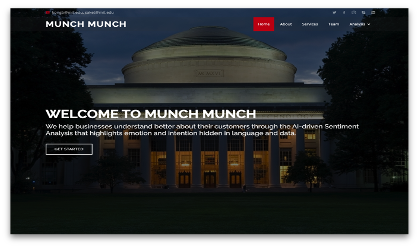
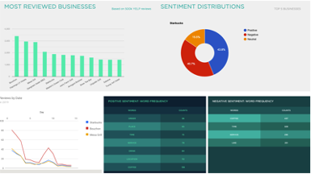
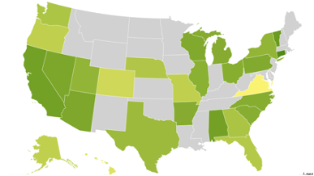
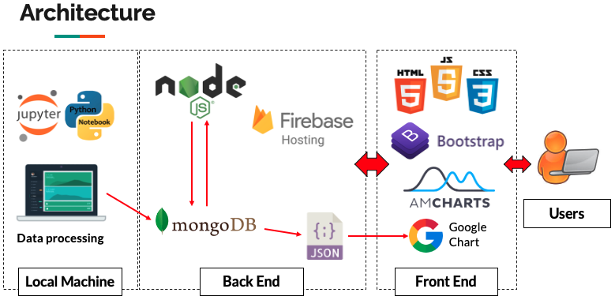

## 1.125 - Sentiment Analysis

#### Team:
* ByeongJo Kong
* Saket Adhikarla

**Dataset:** Yelp dataset available on Kaggle
https://www.kaggle.com/yelp-dataset/yelp-dataset

* 5,200,000 user reviews
* Information on 174,000 businesses
* The data spans 11 metropolitan areas

**Features**
* Sentiment Analysis
* Geographical Analysis

     

 

**Architecture**

 

